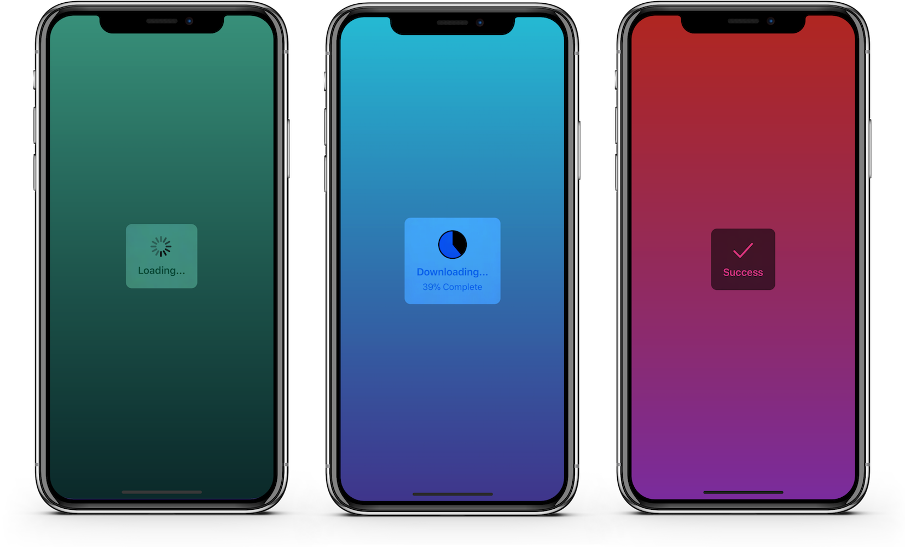
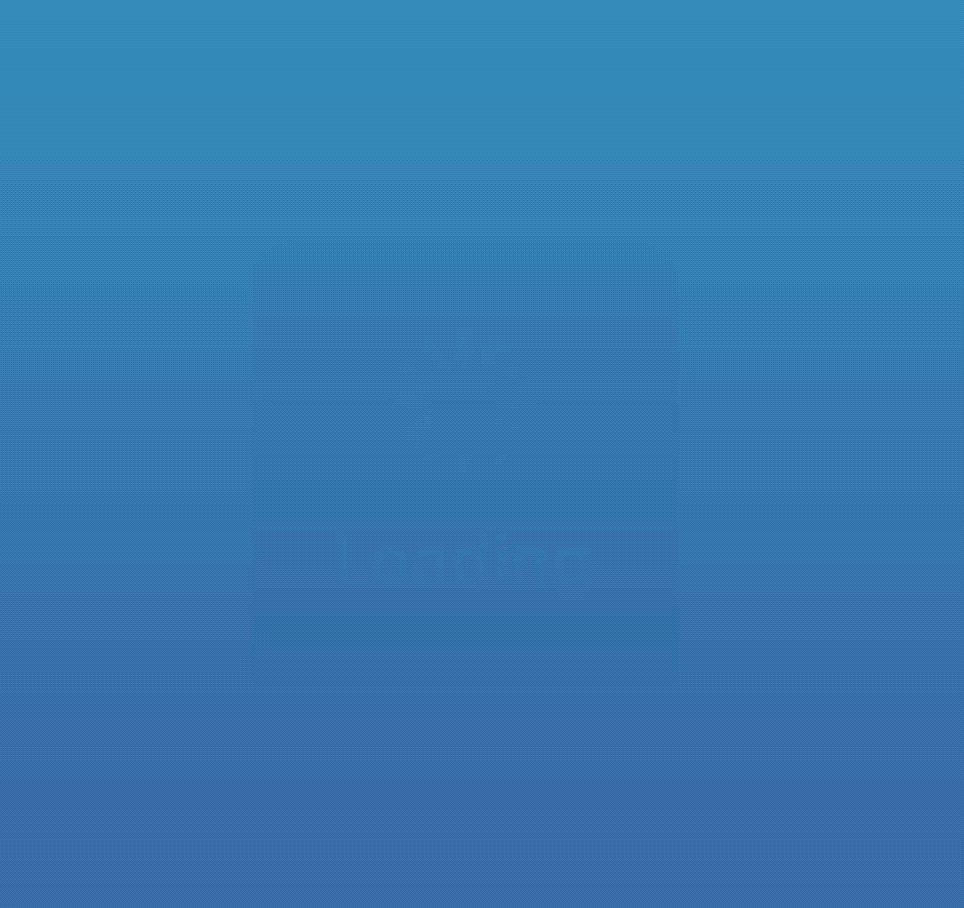
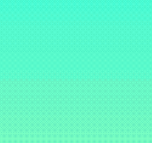

JGProgressHUD
---------------

An elegant and simple progress HUD for iOS and tvOS.<br/>
<p align="center">

</p>

Overview
---------------

__The ultimate progress HUD for iOS and tvOS is here: JGProgressHUD!__

- Plug and play: Simple integration, easy to use, few lines of code required.
- Easily customizable (custom animations, indicator views and more).
- Uses `UIVisualEffectView` and `UIMotionEffect` for a native look.
- Uses AutoLayout to provide a fully dynamic layout.
- Detects and repositions when keyboard appears/disappears.
- Well documented and maintained.
- Voice Over/`UIAccessibility` support.
- Backward compatibility to iOS 8.
- Can be used with Swift and Objective C.
- And most importantly, it looks good!

Download the source code and open the <a href="Examples">Examples</a> project to try JGProgressHUD and see all of its features in action!

[](https://github.com/JonasGessner/JGProgressHUD/releases)
[](https://github.com/JonasGessner/JGProgressHUD/blob/master/LICENSE.txt)
[](https://cocoapods.org/pods/JGProgressHUD)
[](https://github.com/Carthage/Carthage)
[](https://swift.org/package-manager)


Examples
--------------

<p align="center">

&nbsp; &nbsp; &nbsp; &nbsp; &nbsp; &nbsp;

</p>

#### Showing indeterminate progress:

Objective C:

```objc
JGProgressHUD *HUD = [JGProgressHUD progressHUDWithStyle:JGProgressHUDStyleDark];
HUD.textLabel.text = @"Loading";
[HUD showInView:self.view];
[HUD dismissAfterDelay:3.0];
```

Swift:

```swift
let hud = JGProgressHUD(style: .dark)
hud.textLabel.text = "Loading"
hud.show(in: self.view)
hud.dismiss(afterDelay: 3.0)
```

This displays a dark HUD with an activity indicator and the title "Loading". The HUD is presented with a fade animation and is dismissed after 3 seconds with a fade animation.

#### Showing an error message:

```objc
JGProgressHUD *HUD = [JGProgressHUD progressHUDWithStyle:JGProgressHUDStyleDark];
HUD.textLabel.text = @"Error";
HUD.indicatorView = [[JGProgressHUDErrorIndicatorView alloc] init]; //JGProgressHUDSuccessIndicatorView is also available
[HUD showInView:self.view];
[HUD dismissAfterDelay:3.0];
```

#### Showing determinate progress:

```objc
JGProgressHUD *HUD = [JGProgressHUD progressHUDWithStyle:JGProgressHUDStyleDark];
HUD.indicatorView = [[JGProgressHUDPieIndicatorView alloc] init]; //Or JGProgressHUDRingIndicatorView
HUD.progress = 0.5f;
[HUD showInView:self.view];
[HUD dismissAfterDelay:3.0];
```

__For more examples, including in Swift, see <a href="Examples">Examples</a>.__

__Important:__ You should always show `JGProgressHUD` in a `UIViewController` view.

Customization
-----------
### Styles:
JGProgressHUD can be displayed in 3 styles:

- __Extra Light__
- __Light__
- __Dark__

### Indicator Views:
By default a HUD will display an indeterminate progress indicator. The indicator view can be completely hidden by setting the `indicatorView` property to `nil`. These indicator views are available by default:

- __Indeterminate progress indicator__
- __Pie progress indicator__
- __Ring progress indicator__
- __Success indicator__
- __Error indicator__
- __Image indicator__

Custom indicator views can be created by subclassing `JGProgressHUDIndicatorView`.<br/>


### Animations:
By default a HUD will use a fade animation. Several parameters can be altered such as animation duration or animation curve. A HUD can be displayed without animation and different animations can be used. These animations are available by default:

- __Fade__
- __Zoom and Fade__

Custom animations can be created by subclassing `JGProgressHUDAnimation`.

To dim the content behind the HUD set your dim color as `backgroundColor` of your `JGProgressHUD` instance.

Installation
--------------

### Swift Package Manager:

Add `JGProgressHUD` as a dependency in your `Package.swift` file:

```swift
.package(url: "https://github.com/JonasGessner/JGProgressHUD", .upToNextMajor(from: "2.0.0"))
```


### Carthage:
In your `Cartfile` add:

```
github "JonasGessner/JGProgressHUD"
```

### CocoaPods:
In your `Podfile` add:

```
pod 'JGProgressHUD'
```

### Manual Installation:

1. Drag the `JGProgressHUD.xcodeproj` file into your Xcode project.
2. Add `JGProgressHUD.framework` to "Embedded Binaries" in the "General" tab of your target.

-------
After installing import the module where you want to use it:

```objc
@import JGProgressHUD;
```

Swift:

```swift
import JGProgressHUD
```

See the <a href="Examples">Examples</a> project for an example implementation of JGProgressHUD as framework.

Requirements
------------

- Base SDK of iOS/tvOS 11.0 or higher.
- Deployment target of iOS 8.0, tvOS 9.0 or higher.

JGProgressHUD can also be used by projects written in Swift. See <a href="https://github.com/JonasGessner/JGProgressHUD#installation">Installation</a> for details.

Documentation
----------------
Detailed documentation can be found on <a href="http://jonasgessner.github.io/JGProgressHUD/">here</a>.<br/><br/>
Each class and method is well documented, making it easy to quickly get a good overview. To start, see <a href="JGProgressHUD/JGProgressHUD/JGProgressHUD.h">JGProgressHUD.h</a>.

License
---------
MIT License.<br/>
© 2014-2019, Jonas Gessner.

Credits
----------
Created and maintained by Jonas Gessner, © 2014-2019.<br/>
