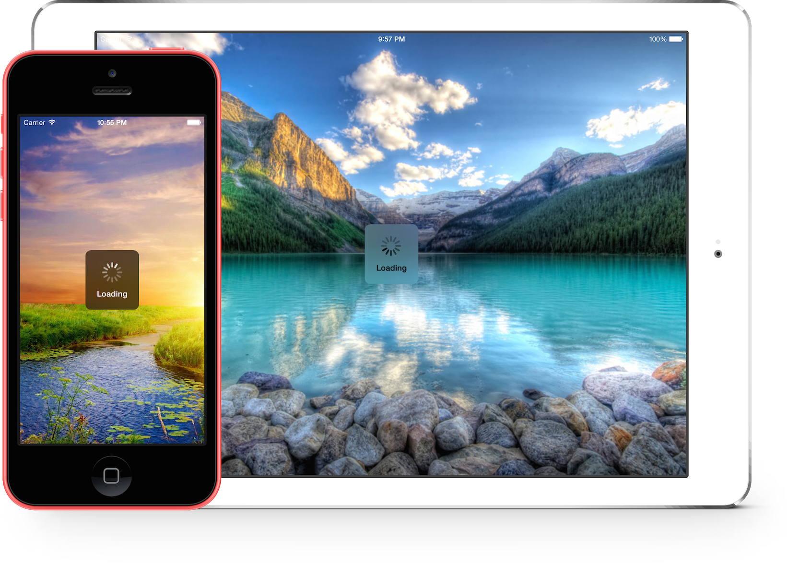

JGProgressHUD
=============

Simple, powerful and modern progress HUD for iOS.<br>
<p align="center">

</p>

Overview
==========

<b>The ultimate progress HUD for iOS has arrived: JGProgressHUD!</b><br>
• Super simple to implement.<br>
• Feature-rich.<br>
• Easy extensibility and customization (custom animations, indicator views and more).<br>
• Up to date and modern, example: Blurred HUD (iOS 8), parallax effect (iOS 7).<br>
• Backward compatibility to iOS 5.<br>
• Well documented.<br>
• Detects and repositions when Keyboards appear/disappear.<br>
• And most importantly, it looks good!<br>
<br>
The <a href="JGProgressHUD%20Tests">JGProgressHUD Tests</a> example project contains all kinds of different uses of JGProgressHUD. Check out the code and see how much JGProgressHUD can do!
<br>
#####Current Version: 1.2.2

##Customization:

###Styles:
JGProgressHUD can be displayed in 3 styles:<br>
• <b>Extra Light</b><br>
• <b>Light<br>
• <b>Dark<br>

###Indicator Views:
By default a HUD will display an indeterminate progress indicator. You can not show an indicator view at all by setting the `indicatorView` property to nil. These indicator views are available:<br>
• <b>Indeterminate progress indicator</b><br>
• <b>Pie progress indicator</b><br>
• <b>Ring progress indicator</b><br>
• <b>Success indicator</b><br>
• <b>Error indicator</b><br>
By subclassing `JGProgressHUDIndicatorView` you can create a custom indicator view!<br>


###Animations:
By default a HUD will use a fade animation. Several parameters can be altered such as animation duration or animation curve. A HUD can be displayed without animation and different animations can be used. By default there are the following animations built in:<br>
• <b>Fade</b><br>
• <b>Zoom and Fade</b><br><br>
By subclassing `JGProgressHUDAnimation` you can create a custom animation!
<br><br>
To dim the content behind the HUD set your dim color as `backgroundColor` of your `JGProgressHUD` instance.

Requirements
=================

• Base SDK of iOS 7 or higher.<br>
• Deployment target of iOS 5 or higher.<br>
• ARC.

Documentation
================
Detailed documentation can be found on <a href="http://cocoadocs.org/docsets/JGProgressHUD">CocoaDocs</a>.<br><br>
Each header file contains detailed documentation for each method call. To start, see <a href="JGProgressHUD/JGProgressHUD/JGProgressHUD.h">JGProgressHUD.h</a>.

Examples
=================
#####Simple example:
```objc
JGProgressHUD *HUD = [JGProgressHUD progressHUDWithStyle:JGProgressHUDStyleDark];
HUD.textLabel.text = @"Loading";
[HUD showInView:self.view];
[HUD dismissAfterDelay:3.0];
```
This displays a dark HUD with a spinner and the title "Loading", it is presented with a fade animation and is dismissed after 3 seconds with a fade animation.
<br><br>
<b>Note:</b> You should preferably show the HUD in a UIViewController's view.
<br><br>
See the <a href="JGProgressHUD%20Tests">JGProgressHUD Tests</a> project for more example implementations.

Installation
================
<b>CocoaPods:</b><br>
Add this to your `Podfile`:
```
pod 'JGProgressHUD'
```
<br>
OR:
<br><br>
<b>As static library:</b><br>
Ideally you should use JGProgressHUD as a static library:<br>
Drag the `JGProgressHUD.xcodeproj` file into your Xcode project. Next, add `JGProgressHUD` and `JGProgressHUD Resources` as Target Dependency in your project's "Build Phases". Then add libJGProgressHUD.a in "Link Binary With Libraries". From the `JGProgressHUD.xcodeproj`'s Products Directory drag the `JGProgressHUD Resources.bundle` into your project's "Copy Bundle Resources". Finally, make sure you have set the `-ObjC` flag in Other Linker Flags.<br><br>
See the <a href="JGProgressHUD%20Tests">JGProgressHUD Tests</a> project for an example implementation of JGProgressHUD as static library.
<br><br>
OR:
<br><br>
<b>Using source files:</b><br>
Add all files from <a href="JGProgressHUD/JGProgressHUD">JGProgressHUD</a> to your project.
<br><br>
After you have included JGProgressHUD as static library or source files simply import `JGProgressHUD.h`.
<br><br>
####RubyMotion
An example of JGProgressHUD in a RubyMotion project can be found  [here](https://github.com/IconoclastLabs/rm-jgprogresshud-example).

Screenshots
============
<p align="center">
&nbsp;
&nbsp;
&nbsp;

</p>

License
==========
MIT License.<br>
©2014, Jonas Gessner.

Credits
==========
Created by Jonas Gessner, ©2014.<br>
