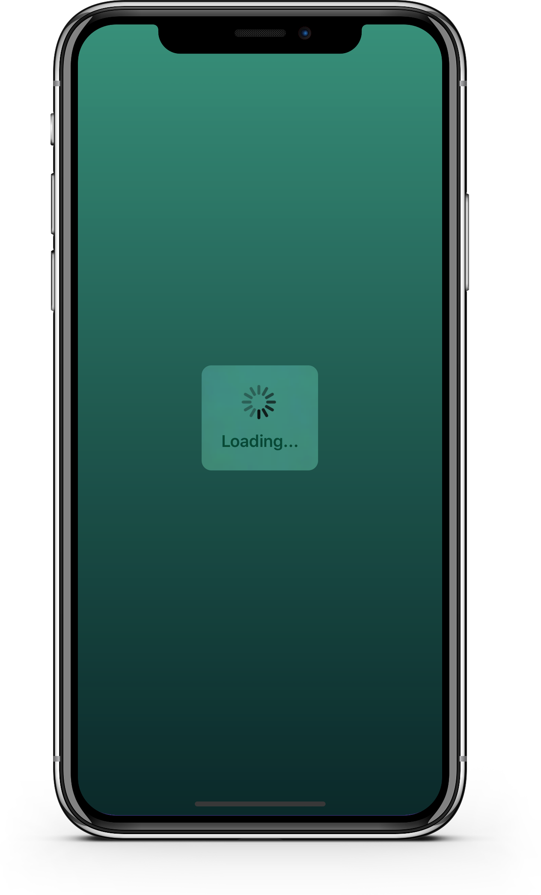
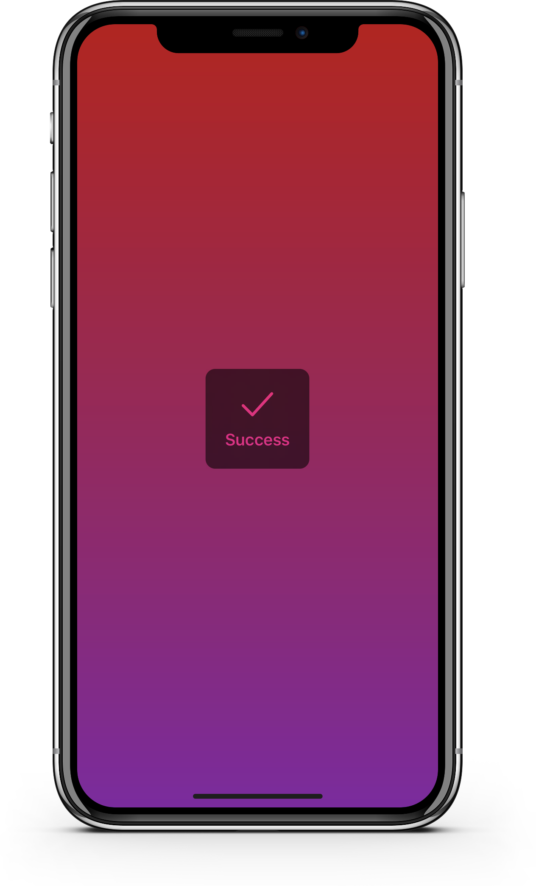
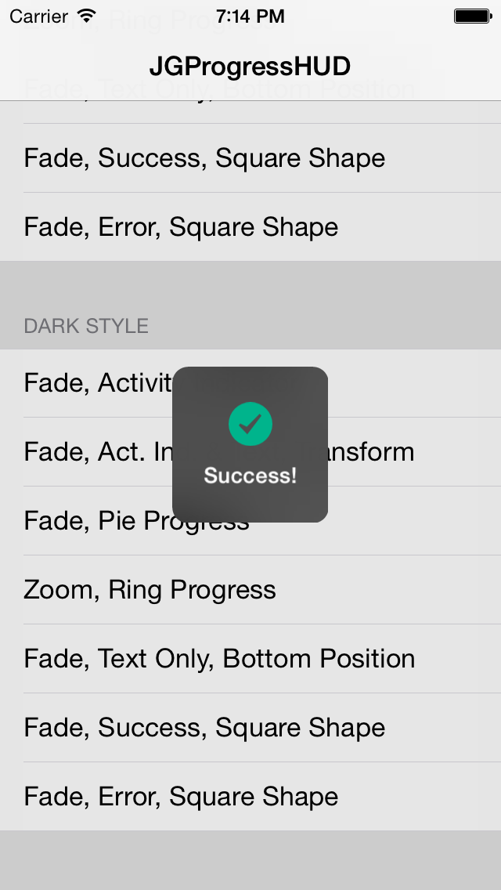

JGProgressHUD
=============

Modern and extensive Apple-style progress HUD for iOS.<br>
<p align="center">

</p>
Overview
==========

<b>The ultimate progress HUD for iOS has arrived: JGProgressHUD!</b><br>
• Well designed, easy to use.<br>
• Feature-rich.<br>
• Extensible and customizable (custom animations, indicator views and more).<br>
• Uses the newest features of iOS: Blurred HUD (iOS 8+), parallax effect (iOS 7+).<br>
• Backward compatibility to iOS 6.<br>
• Well documented and maintained.<br>
• Detects and repositions when keyboard appears/disappears.<br>
• Voice Over/`UIAccessibility` support.<br>
• And most importantly, it looks good!<br>
<br>
The <a href="Examples">Examples</a> project contains all kinds of different uses of JGProgressHUD. Check out the code and see what JGProgressHUD can do!
<br>
<br>
[](https://github.com/JonasGessner/JGProgressHUD/releases)
[](https://github.com/JonasGessner/JGProgressHUD/blob/master/LICENSE.txt)
[](https://cocoapods.org/pods/JGProgressHUD)
[](https://github.com/Carthage/Carthage)
##Customization:

###Styles:
JGProgressHUD can be displayed in 3 styles:<br>
• <b>Extra Light</b><br>
• <b>Light</b><br>
• <b>Dark</b><br>

###Indicator Views:
By default a HUD will display an indeterminate progress indicator. You can not show an indicator view at all by setting the `indicatorView` property to nil. These indicator views are available:<br>
• <b>Indeterminate progress indicator</b><br>
• <b>Pie progress indicator</b><br>
• <b>Ring progress indicator</b><br>
• <b>Success indicator</b><br>
• <b>Error indicator</b><br>
• <b>Image indicator</b><br>
By subclassing `JGProgressHUDIndicatorView` you can create a custom indicator view!<br>


###Animations:
By default a HUD will use a fade animation. Several parameters can be altered such as animation duration or animation curve. A HUD can be displayed without animation and different animations can be used. By default there are the following animations built in:<br>
• <b>Fade</b><br>
• <b>Zoom and Fade</b><br><br>
By subclassing `JGProgressHUDAnimation` you can create a custom animation!
<br><br>
To dim the content behind the HUD set your dim color as `backgroundColor` of your `JGProgressHUD` instance.

Requirements
=================

• Base SDK of iOS 8 or higher.<br>
• Deployment target of iOS 6.0 or higher.<br>
• ARC.

• JGProgressHUD can also be used by projects written in Swift. See <a href="https://github.com/JonasGessner/JGProgressHUD#installation">Installation</a> for details.

Documentation
================
Detailed documentation can be found on <a href="http://cocoadocs.org/docsets/JGProgressHUD">CocoaDocs</a>.<br><br>
Each method is well documented, making it easy to quickly get a great overview of JGProgressHUD. To start, see <a href="JGProgressHUD/JGProgressHUD/JGProgressHUD.h">JGProgressHUD.h</a>.

Examples
=================
#####Showing indeterminate progress:
```objc
JGProgressHUD *HUD = [JGProgressHUD progressHUDWithStyle:JGProgressHUDStyleDark];
HUD.textLabel.text = @"Loading";
[HUD showInView:self.view];
[HUD dismissAfterDelay:3.0];
```
This displays a dark HUD with a spinner and the title "Loading", it is presented with a fade animation and is dismissed after 3 seconds with a fade animation.
<br>
#####Showing an error message:
```objc
JGProgressHUD *HUD = [JGProgressHUD progressHUDWithStyle:JGProgressHUDStyleDark];
HUD.textLabel.text = @"Error";
HUD.indicatorView = [[JGProgressHUDErrorIndicatorView alloc] init]; //JGProgressHUDSuccessIndicatorView is also available
[HUD showInView:self.view];
[HUD dismissAfterDelay:3.0];
```
#####Showing a custom image:
```objc
JGProgressHUD *HUD = [JGProgressHUD progressHUDWithStyle:JGProgressHUDStyleDark];
HUD.indicatorView = [[JGProgressHUDImageIndicatorView alloc] initWithImage:[UIImage imageNamed:@"my_image.png"]];
[HUD showInView:self.view];
[HUD dismissAfterDelay:3.0];
```
#####Showing determinate progress:
```objc
JGProgressHUD *HUD = [JGProgressHUD progressHUDWithStyle:JGProgressHUDStyleDark];
HUD.indicatorView = [[JGProgressHUDPieIndicatorView alloc] initWithHUDStyle:HUD.style]; //Or JGProgressHUDRingIndicatorView
[HUD showInView:self.view];
[HUD dismissAfterDelay:3.0];
```
<br>
<b>Important:</b> You should always show HUDs in a UIViewController's view.
<br><br>
See the <a href="Examples">Examples</a> project for more example implementations.

Installation
================
<b>CocoaPods:</b><br>
Add this to your `Podfile`:
```
pod 'JGProgressHUD'
```
<br>
OR:
<br><br>
<b>Carthage:</b><br>
Add this to your `Cartfile`:
```
github "JonasGessner/JGProgressHUD" >= 1.3.1
```
<br>
OR:
<br><br>
<b>Framework (iOS >= 8.0 only):</b><br>
1. Drag the `JGProgressHUD.xcodeproj` file into your Xcode project.<br>
2. Add `JGProgressHUD.framework` to "Embedded Binaries" in the "General" tab of your project's target.<br>
3. Add the `-ObjC` flag to "Other Linker Flags" in the "Build Settings" tab of your project's target.<br><br>
See the <a href="Examples">Examples</a> project for an example implementation of JGProgressHUD as framework.
<br><br>
After you have included JGProgressHUD as framework simply import `JGProgressHUD.h` like this:
```objc
#import <JGProgressHUD/JGProgressHUD.h>
```
Swift projects:
```swift
import JGProgressHUD
```
<br><br>
OR:
<br><br>
<b>Static Library:</b><br>
1. Drag the `JGProgressHUD.xcodeproj` file into your Xcode project.<br>
2. Add `JGProgressHUD` and `JGProgressHUD Resources` to "Target Dependencies" in the "Build Phases" tab of your project's target.<br>
3. Add `libJGProgressHUD.a` to "Link Binary With Libraries".<br>
4. From the `JGProgressHUD.xcodeproj`'s "Products" Directory drag the `JGProgressHUD Resources.bundle` into the "Copy Bundle Resources" section.<br>
5. Add the `-ObjC` flag to "Other Linker Flags" in the "Build Settings" tab of your project's target.<br><br>
See the <a href="Examples">Examples</a> project for an example implementation of JGProgressHUD as static library.
<br><br>
After you have included JGProgressHUD as static library simply import `JGProgressHUD.h` like this:
```objc
#import "JGProgressHUD.h"
```
Swift projects need to import JGProgressHUD in the Objective-C bridging header.
<br><br>
####RubyMotion
An example of JGProgressHUD in a RubyMotion project can be found  [here](https://github.com/IconoclastLabs/rm-jgprogresshud-example).

Screenshots
============
<p align="center">
&nbsp;
&nbsp;
&nbsp;

</p>

License
==========
MIT License.<br>
© 2014-2016, Jonas Gessner.

Credits
==========
Created and maintained by Jonas Gessner, © 2014-2016.<br>
